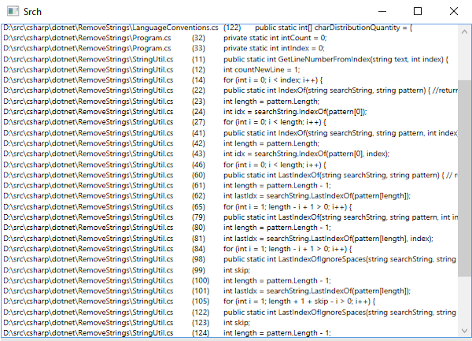

# Srch

A code searching tool for windows

## Features

- Boyer-Moore
- Parallel search threads
- Utilizing char distribution (currently optimized for C)
- RegEx
- Case-Sensitivity
- Whole word Only
- Multistring search
- Extension filter
- Drag & Drop
- GUI

## How to Use 

Run srch.exe and drag & drop a folder you want to search.

- CTRL + F<pre>Search text</pre>
- CTRL + Shift + F<pre>Search files</pre>
- CTRL + C<pre>Cancel search</pre>
- CTRL + S<pre>Settings</pre>
- CTRL + M<pre>Multistring search</pre>
- CTRL + ENTER<pre>Search selected text (global hotkey)</pre>
- F1 to F12<pre>Load options from files</pre>

Edit the .txt files in the root folder to specify the default search path.

## Open Performance optimizations

1. Reduce the amount of exception handlers (try/catch).
2. Using the functionality encapsulated in the options class is convenient (e.g. options.GetValue(Options.AvailableOptions.SearchInComments)), but slows down the search queries (in the example case by ~30-40ms).

## Known Bugs

- Hotkeys only work in the first instance, other registrations fail.
- Window does not redraw occasionally.

## Usability improvements

- Highlight the searchstring in the results (a switch to richtext is needed).
- Implement a more intuitive color picker.

## Compiling

The application is compiled with

* Microsoft Visual Studio Express 2012 Version 11.0.61219.00 Update 5
* Microsoft .NET Framework  Version 4.6.01055

## Licensing

[MIT](https://github.com/bernardtaubert/srch/blob/master/LICENSE)
